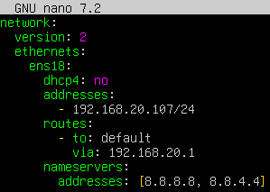

# Zerbitzariaren Konfigurazio eta Administrazio Proiektua

## Aurkibidea

1. [Sistema Eragilearen Instalazioa](#sistema-eragilearen-instalazioa)
2. [Sare Konfigurazioa](#sare-konfigurazioa-ubuntu-server-makinarena)
3. [Erabiltzaileak eta Baimenak](#erabiltzaileak-eta-baimenak-ubuntu-server-makinan)

---

## Sistema Eragilearen Instalazioa

### Proxmox VE Instalazioa

#### Aurrebaldintzak
- **Hardware eskakizunak:**
  - CPU: 64-bit prozesadorea (Intel edo AMD VT onartzen duena)
  - RAM: Gutxienez 4GB (gomendatua 8GB edo gehiago)
  - Diskoa: Gutxienez 32GB
  - Sare txartela: Gigabit Ethernet

#### Instalazio Pausuak

1. **ISO Irudia Deskargatu**
   ```bash
   # Deskargatu Proxmox VE ISOs hemen:
   https://www.proxmox.com/en/downloads
   ```

2. **USB Booteable Bat Sortu**
   - Rufus edo Etcher erabili

3. **Instalatu Proxmox VE**
   - USB-tik abiatu
   - Hizkuntza aukeratu
   - Lizentzia onartu (EULA)
   - Disko gogorra aukeratu
   - Herrialdea, timezone eta teklatu-diseinua konfiguratu
   - Root pasahitza ezarri eta email helbidea sartu
   - Sare konfigurazioa ezarri (aldi baterako DHCP erabil dezakezu)
   - Instalatu eta berrabiarazi

4. **Web Interfazera Sartu**
   - Nabigatzailean ireki: `https://IP-HELBIDEA:8006`. Gurea 192.168.20.146:8006 da.
   - Erabiltzailea: `root`
   - Pasahitza: Instalazioan ezarritakoa. Gurea: 12345678

### Makina Birtual Berria Sortu

#### GUI Bidez

1. **Proxmox web interfazean:**
   - Klik egin `Create VM` botoian (goiko eskuinean)

2. **General Tab:**
   - Node: zure nodoa hautatu
   - VM ID: automatikoki esleituko da (adib. 100)
   - Name: `zerbitzari` edo antzekoa

3. **OS Tab:**
   - ISO Image: Ubuntu ISOa aukeratu
   - Guest OS: Linux aukeratu
   - Version: zure aukeratutako bertsioa

4. **System Tab:**
   - Graphic card: Default (SPICE)
   - SCSI Controller: VirtIO SCSI
   - Qemu Agent: aktibatu (gomendatua)

5. **Disks Tab:**
   - Bus/Device: SCSI
   - Storage: local-lvm
   - Disk size: 20-50 GB (zure beharraren arabera)
   - Cache: Write back (aukerakoa)

6. **CPU Tab:**
   - Cores: 2 (gomendatua)
   - Type: host (onena errendimendurako)

7. **Memory Tab:**
   - Memory (MiB): 2048 (2 GB)
   - Minimum memory: 512
   - Ballooning Device: aktibatu

8. **Network Tab:**
   - Bridge: vmbr0
   - Model: VirtIO (paravirtualized)
   - MAC address: auto

9. **Confirm:**
   - Klik egin `Finish`
   - Markatu `Start after created`

#### Makina Birtual Abiatu eta Sistema Eragilea Instalatu

1. **VM-a abiarazi:**
   - Hautatu VM-a ezkerreko menuan
   - Klik egin `Start` botoian
   - Klik egin `Console` ikustera joateko

2. **Debian/Ubuntu Instalazioa:**
   - Jarraitu instalazioaren pausuak
   - Hizkuntza: Euskara (edo nahiago duzuna)
   - Partizioak: "Erabili disko osoa" (bakarra bada)
   - Root pasahitza ezarri
   - Erabiltzaile normala sortu
   - Software hautaketa: SSH server eta oinarrizko sistemako utilitateak

3. **Instalazio ondoren:**
   ```bash
   # Eguneratu sistema
   sudo apt update && sudo apt upgrade -y
   
   # Instalatu oinarrizko tresnak
   sudo apt install -y vim curl wget git htop net-tools
   ```

---

## Sare Konfigurazioa (Ubuntu Server makinarena)

### Sare Parametroak

| Parametroa | Balioa |
|------------|--------|
| IP Helbidea | 192.168.20.107 |
| Sare Maskara | 255.255.255.0 (/24) |
| Gateway | 192.168.20.1 |
| DNS | 8.8.8.8 |

### Sare Konfigurazio Estatiko

#### Netplan Erabiliz

Editatu `/etc/netplan/05-cloud-init.yaml` fitxategia:

```yaml
network:
  version: 2
  ethernets:
    ens18:
      dhcp4: no
      addresses:
        - 192.168.20.107/24
      routes:
        - to: default
          via: 192.168.20.1
      nameservers:
        addresses:
          - 8.8.8.8
          - 8.8.4.4
```

Gure Ubuntu Server-en konfigurazioa da. Hona hemen argazkia:




Aplikatu konfigurazioa:
```bash
sudo netplan apply
```

### Konexioa Egiaztatu

```bash
# IP konfigurazioa ikusi
ip addr show

# Gateway-a frogatu
ping -c 4 192.168.201.1

# Internet konexioa frogatu
ping -c 4 8.8.8.8

# DNS konexioa frogatu
ping -c 4 google.com

# Sare interfaze guztiak ikusi
ip link show

# Routing taula ikusi
ip route show
```

---

## Erabiltzaileak eta Baimenak (Ubuntu Server makinan)

### Erabiltzaile Konfigurazioaren Laburpena

| Erabiltzailea | Helburua | Karpeta Nagusia |
|---------------|----------|-----------------|
| **frontuser** | Frontend fitxategiak FTP bidez | /var/wwww/html/app |
| **backuser** | Backend fitxategiak SSH/GIT bidez | /var/wwww/html/app |

### Erabiltzaileak Sortu

#### 1. frontuser sortu (FTP soilik)

```bash
# Erabiltzailea sortu
sudo adduser frontuser

# Bere talde bat sortu gerorako
sudo groupadd front
sudo usermod -aG front frontuser

# Pasahitza ezarri eta informazioa bete
# Pasahitza: 1234

# Web direktorioa sortu
sudo mkdir -p /var/wwww/html/app

```

#### 2. backuser sortu (SSH/GIT soilik)

```bash
# Erabiltzailea sortu
sudo adduser backuser

# Pasahitza ezarri
# Pasahitza: 1234

# App direktorioan baimenak eman bi erabiltzaileei
sudo chown backuser:front /var/www/html/app
sudo chmod 775 /var/www/html/app
```

### Baimenak Egiaztatu

```bash
# Aplikazioaren direktorioaren baimenak
ls -la /var/www/html/app

# Frogatu FTP konexioa (beste bezero batetik)
ftp 192.168.20.107
# Erabiltzailea: frontuser
# Pasahitza: 1234

# Frogatu SSH konexioa
ssh backuser@192.168.20.107
```

---