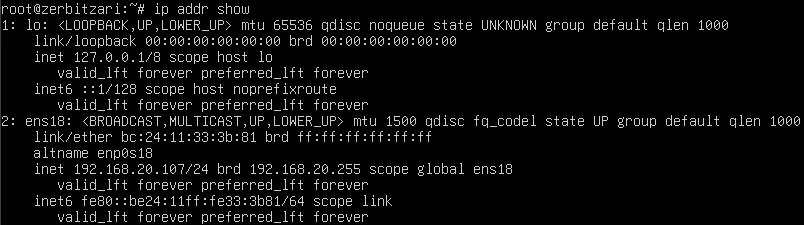
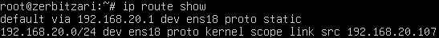
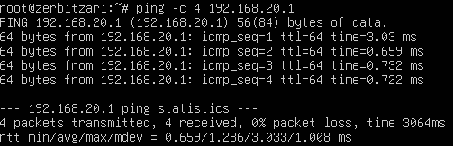
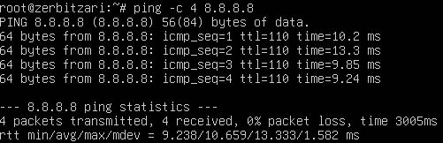
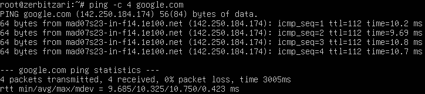
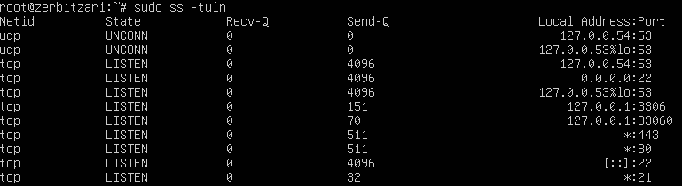
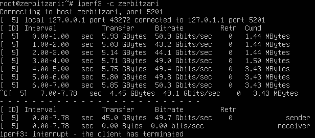
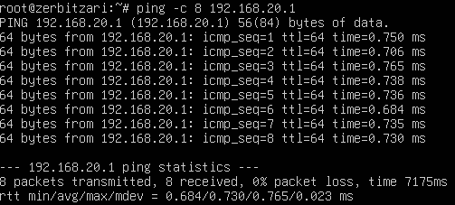
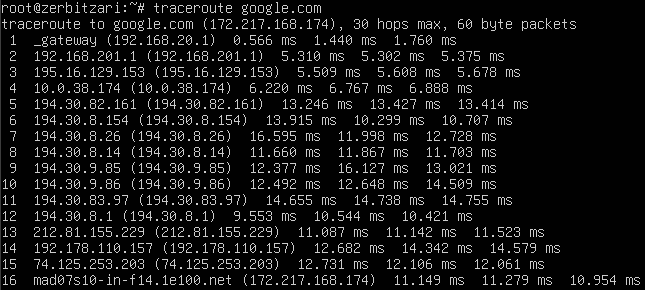

# Sarearen Diagnostiko Txostena

---

## 1. Sare Konfigurazioa

### 1.1 Interfaze Konfigurazioa

**Komandoa exekutatua:**
```bash
ip addr show
```

**Pantaila-argazkia:**




**Emaitza Taula:**

| Interfazea | IP Helbidea | Maskara | Egoera | MAC Helbidea |
|------------|-------------|---------|--------|--------------|
| ens18 | 192.168.20.107 | /24 | UP | bc:24:11:33:3b:81 |
| lo | 127.0.0.1 | /8 | UP | 00:00:00:00:00:00 |

**Ondorioak:**
- IP helbidea ondo konfiguratuta: 192.168.20.107
- Sare interfazea aktibo (UP)
- Loopback interfazea ondo konfiguratuta

---

### 1.2 Routing Taula

**Komandoa exekutatua:**
```bash
ip route show
```

**Pantaila-argazkia:**




**Emaitza:**
```
default via 192.168.20.1 dev ens18
192.168.20.0/24 dev ens18 proto kernel scope link src 192.168.20.107
```

**Ondorioak:**
- Gateway ondo konfiguratuta: 192.168.20.1
- Sare lokala ondo definituta

---

## 2. Konektibitate Probak

### 2.1 Gateway Proba

**Komandoa exekutatua:**
```bash
ping -c 4 192.168.201.1
```

**Pantaila-argazkia:**




**Emaitzak:**

| Metrika | Balioa |
|---------|--------|
| Pakete bidaliak | 4 |
| Pakete jasotakoak | 4 |
| Galera ehunekoa | 0% |
| RTT min/avg/max/mdev | 0,659/1,286/3,033/1,008 ms |

**Ondorioak:**
- Gateway-a iristegarria
- Ez dago pakete galerarik
- Latentzia normala (< 10ms)

---

### 2.2 DNS Zerbitzariaren Proba

**Komandoa exekutatua:**
```bash
ping -c 4 8.8.8.8
```

**Pantaila-argazkia:**




**Emaitzak:**

| Metrika | Balioa |
|---------|--------|
| Pakete bidaliak | 4 |
| Pakete jasotakoak | 4 |
| Galera ehunekoa | 0% |
| RTT min/avg/max/mdev | 9,238/10,659/13,333/1,582 ms |

**Ondorioak:**
- DNS zerbitzaria iristegarria
- Internet konexioa funtzionatzen du

---

### 2.3 DNS Ebazpen Proba

**Komandoa exekutatua:**
```bash
nslookup google.com
```

**Pantaila-argazkia:**


**Emaitza:**
```
Server:     127.0.0.53
Address:    127.0.0.53#53

Non-authoritative answer:
Name:   google.com
Address: 142.250.184.14
```

**Ondorioak:**
- DNS ebazpena ondo funtzionatzen du
- Domeinuak ondo ebazten dira

---

### 2.4 Kanpoko Konexio Proba

**Komandoa exekutatua:**
```bash
ping -c 4 google.com
```

**Pantaila-argazkia:**




**Emaitzak:**

| Metrika | Balioa |
|---------|--------|
| Pakete bidaliak | 4 |
| Pakete jasotakoak | 4 |
| Galera ehunekoa | 0% |
| RTT min/avg/max/mdev | 9,685/10,325/10,750/0,423 ms |

**Ondorioak:**
- Internet konexioa ondo funtzionatzen du
- DNS + routing guztia ondo

---

## 3. Portu eta Zerbitzuen Egoera

### 3.1 Entzuten Dauden Portuak

**Komandoa exekutatua:**
```bash
sudo ss -tuln
```

**Pantaila-argazkia:**




**Portuen Taula:**

| Protokoloa | Portua | Egoera | Zerbitzua |
|------------|--------|--------|-----------|
| TCP | 22 | LISTEN | SSH |
| TCP | 21 | LISTEN | FTP |
| TCP | 80 | LISTEN | HTTP |
| TCP | 443 | LISTEN | HTTPS |

**Ondorioak:**
- SSH portua (22) entzuten
- FTP portua (21) entzuten
- HTTP portua (80) entzuten
- HTTPS portua (443) entzuten

---

### 3.2 Konexio Aktiboak

**Komandoa exekutatua:**
```bash
sudo ss -tan | head -20
```

**Pantaila-argazkia:**


**Konexio kopurua egoeraren arabera:**

| Egoera | Konexio Kopurua |
|--------|-----------------|
| LISTEN | 9 |

**Ondorioak:**
-  Konexio kopuru normala
-  Ez dago konexio anomalorik

---

## 5. Errendimendu Probak

### 5.1 Bandwidth Proba (iperf3)

**Komandoa exekutatua:**
```bash
iperf3 -c ZERBITZARIA
```

**Pantaila-argazkia:**




**Ondorioak:**
-  Bandwidth esperatua
-  Transfer egonkorra

---

### 5.2 Latentzia Proba

**Komandoa exekutatua:**
```bash
ping -c 100 192.168.201.1
```

**Pantaila-argazkia:**




**Estatistikak:**

| Metrika | Balioa |
|---------|--------|
| Pakete kopurua | 8 |
| Galera % | 0% |
| RTT min/avg/max/mdev | 0,684/0,730/0,765/0,023 ms |

**Ondorioak:**
-  Latentzia baxua
-  Ez dago galerarik (0%)

---

### 5.3 Traceroute Analisia

**Komandoa exekutatua:**
```bash
traceroute google.com
```

**Pantaila-argazkia:**




**Ondorioak:**
-  Bidea normala
-  Ez dago timeout-ik

---

## 6. Ondorio Orokorrak - Egoera Laburpena

| Proba | Egoera | Azalpenak |
|-------|--------|-----------|
| IP Konfigurazioa |  Ondo | IP estatikoa ondo konfiguratuta |
| Gateway Konexioa |  Ondo | Gateway-ra iristen da |
| DNS Ebazpena |  Ondo | Domeinuak ondo ebazten dira |
| Internet Konexioa |  Ondo | Kanpoko zerbitzariak iristegarriak |
| Zerbitzu Portuak |  Ondo | Beharrezko portuak irekita |
| Errendimendua |  Ondo | Bandwidth eta latentzia normalak |

---