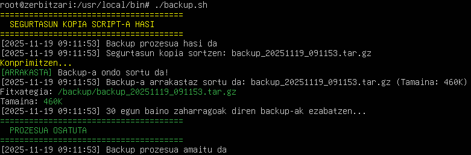
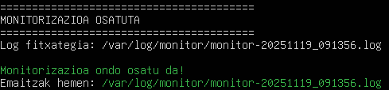
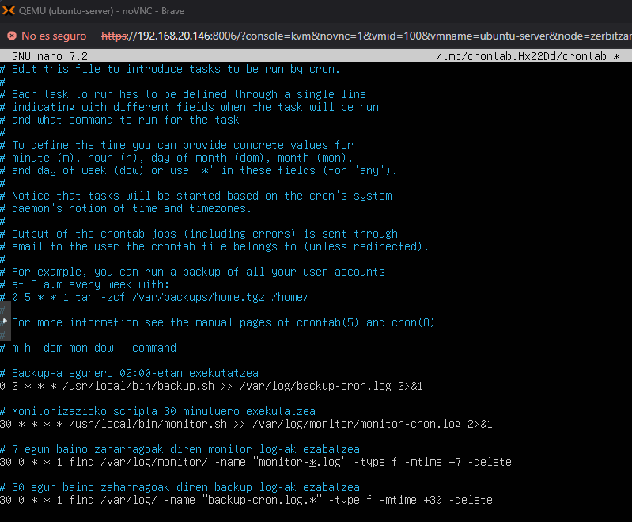

## Script-ak eta Automatizazioa

### backup.sh - Segurtasun Kopia Script-a

#### Deskribapena
Script honek aplikazioaren webgunearen segurtasun kopia bat sortzen du `.tar.gz` formatuan, egungo data izena erabiliz.
Scriptaren fitxategian bertan bebai daude komentarioak haren erabilera hobeto ulertzeko.

#### Ezaugarriak
- Direktorio bat konprimitu eta babes-kopia egin
- Egungo datarekin fitxategia izendatu
- 30 egun baino zaharragoak diren backup-ak automatikoki ezabatu
- Log fitxategia sortu jarraipenerako
- Errore kudeaketa

#### Instalazioa

```bash
# Script-a deskargatu edo sortu
sudo nano /usr/local/bin/backup.sh

# Script-aren edukia kopiatu

# Exekuzio baimenak eman
sudo chmod +x /usr/local/bin/backup.sh

# Backup direktorioa sortu
sudo mkdir -p /backup
```

#### Erabilera

```bash
# Eskuz exekutatu
sudo /usr/local/bin/backup.sh

# Emaitza:
# - Fitxategia: /backup/backup_20251118_085525.tar.gz
# - Log-a: /var/log/backup.log
```



### monitor.sh - Baliabideen Monitorizazio Script-a

#### Deskribapena
Script honek sistemaren baliabideen informazio osoa batzen du: CPU, memoria, diskoa, sarea eta zerbitzuak.
Scriptaren fitxategian bertan bebai daude komentarioak haren erabilera hobeto ulertzeko.

#### Ezaugarriak
- Informazio osoa batzen du sistema osotik
- Log fitxategi bakoitzean data izendatua
- 7 egun baino zaharragoak diren log-ak ezabatu
- Irakurgarria eta antolatua
- Kolore onarpena terminalean

#### Instalazioa

```bash
# Script-a sortu
sudo nano /usr/local/bin/monitor.sh

# Script-aren edukia kopiatu

# Exekuzio baimenak eman
sudo chmod +x /usr/local/bin/monitor.sh

# Log direktorioa sortu
sudo mkdir -p /var/log/monitor
```

#### Erabilera

```bash
# Eskuz exekutatu
sudo /usr/local/bin/monitor.sh

# Emaitza ikusi
cat /var/log/monitor/monitor-$(date +%Y%m%d)*.log
```



### Cron Bidez Automatizazioa

#### Cron Sarrera Editatu

```bash
# Root erabiltzailearen crontab editatu
sudo crontab -e
```

#### Backup Automatikoa - Egunero Gaueko 2:00etan

```bash
# Backup script-a egunero 02:00etan exekutatu
0 2 * * * /usr/local/bin/backup.sh >> /var/log/backup-cron.log 2>&1
```

#### Monitorizazioa - Ordu erdiro

```bash
# Monitorizazioa ordu erdiro
30 * * * * /usr/local/bin/monitor.sh >> /var/log/monitor/monitor-cron.log 2>&1
```


---