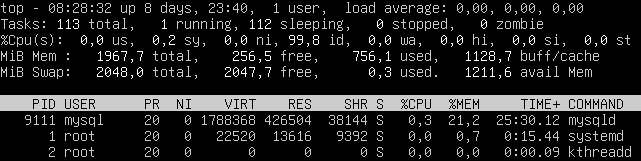
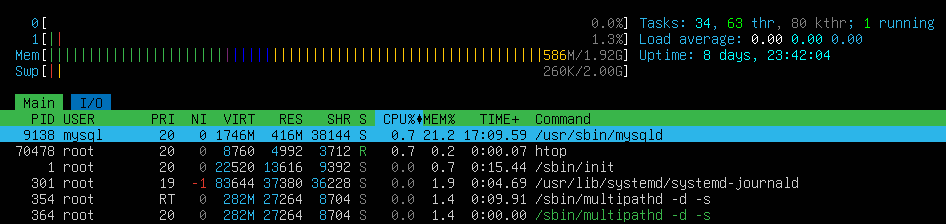
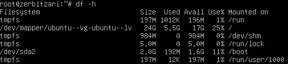
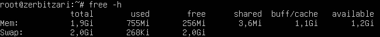
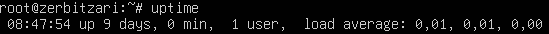
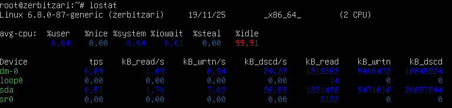

# Sistemaren baliabideen azterketa

#### 1. top / htop - Prozesuen Jarraipena

**top komandoa:**
```bash
top
```



**Informazioa:**
- **1. lerroa (uptime)**: Sistema noiz abiarazi zen eta erabiltzaile kopurua
- **2. lerroa (Tasks)**: Prozesu kopurua eta egoera (running, sleeping, stopped, zombie)
- **3. lerroa (CPU)**: CPU erabilera ehunekoa
  - `us`: user (erabiltzaile prozesuen CPU)
  - `sy`: system (sistemaren prozesuen CPU)
  - `id`: idle (libre dagoen CPU)
  - `wa`: wait (I/O itxaroten)
- **4. lerroa (Memory)**: RAM erabileraren zehaztapena
- **5. lerroa (Swap)**: Swap memoria erabileraren zehaztapena
- **Prozesu zerrenda**: CPU edo memoria gehien erabiltzen duten prozesuen zerrenda

**htop komandoa (hobetua):**
```bash
# Instalatu behar bada
sudo apt install htop -y

# Exekutatu
htop
```



**htop-en abantailak:**
- Interfaze koloreduna eta erabilgarriagoa
- Mouse onarpena
- Prozesuak zuzenean kudeatu (F9 kill, F7/F8 priority)
- CPU core guztiak ikusi
- Prozesuen zuhaitz-ikuspegia (F5)

**Tekla erabilgarriak:**
- `F1`: Laguntza
- `F3`: Bilatu prozesua
- `F4`: Filtratu
- `F5`: Zuhaitz-ikuspegia
- `F6`: Ordenatu (CPU, MEM, PID...)
- `F9`: Kill prozesua
- `F10`: Irten
- `Space`: Markatu prozesua

#### 2. df -h - Diskoko Partizioen Erabilera

```bash
df -h
```



**Erakusten den informazioa:**
- **Filesystem**: Partizioaren izena
- **Size**: Partizioaren tamaina osoa
- **Used**: Erabilitako espazioa
- **Avail**: Erabilgarri dagoen espazioa
- **Use%**: Erabileraren ehunekoa
- **Mounted on**: Mount puntua (non erakusten den fitxategi sisteman)

**Gomendatutako balioak:**
- < 70%: Egoera ona
- 70-85%: Kontu izan
- > 85%: Espazioa liberatu behar da

#### 3. free -h - Memoria Erabilera

```bash
free -h
```



**Erakusten den informazioa:**
- **total**: Memoria osoa
- **used**: Erabilitako memoria (programa aktiboak)
- **free**: Erabiltzen ez den memoria
- **shared**: Prozesu askoren artean partekatutako memoria
- **buff/cache**: Cache-rako erabilitako memoria (errendimendua hobetzeko)
- **available**: Erabilgarri dagoen memoria benetan (cache-a kontuan hartuta)

**Swap memoria:**
- Diskoan gordetako memoria (RAM-a bete denean)
- Swap erabilera handia = RAM-aren presioa

**Interpretazioa:**
```
              total        used        free      shared  buff/cache   available
Mem:           1.9Gi       755Mi       256Mi      3.6Mi       1.1Gi       1.2Gi
Swap:          2.0Gi       268Ki       2.0Gi
```

- Memoria disponible ona: > 20% total-etik
- Swap konstanteki erabiltzen bada: RAM gehiago behar da

#### 4. uptime - Sistemaren Funtzionamendu-denbora

```bash
uptime
```



**Informazioa:**
- **8:47:54**: Ordu aktuala
- **up 9 days, 0 min**: Sistema 9 egun eta 0 minutu martxan
- **1 users**: 1 erabiltzaile konektatuta
- **load average**: Sistemaren karga batez-bestekoa
  - 1. balioa: azken minutuko karga
  - 2. balioa: azken 5 minutuko karga
  - 3. balioa: azken 15 minutuko karga

**Load average interpretazioa:**
- 1 core-ko sistema:
  - < 1.0: Ondo
  - 1.0-2.0: Kargatuta
  - > 2.0: Gainkargatuta
- 4 core-ko sistema:
  - < 4.0: Ondo
  - 4.0-8.0: Kargatuta
  - > 8.0: Gainkargatuta

#### 5. iostat - Diskoko I/O Errendimendua (aukerakoa)

```bash
# Instalatu behar bada
sudo apt install sysstat -y

# Exekutatu
iostat 
```

