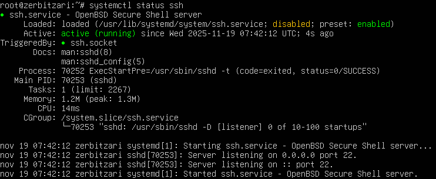
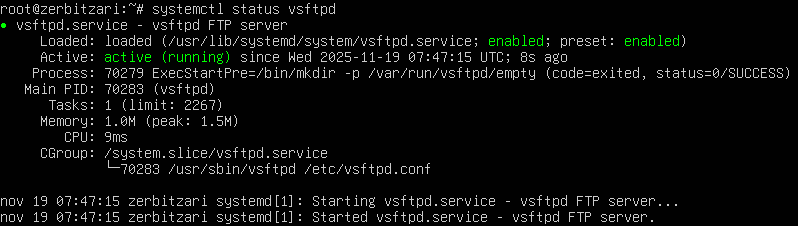
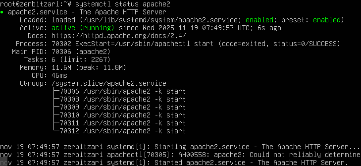
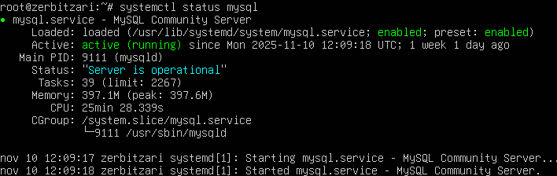

# Zerbitzuen Monitorizazio Taula

**Data:** 2025/11/18
**Ordua:** 08:15
**Zerbitzaria:** Talde 1

---

## 1. Zerbitzu Nagusien Egoera

### 1.1 Egoera Taula

| Zerbitzua | Komandoa | Egoera | Portua | Enabled | Azken Egiaztapena |
|-----------|----------|--------|--------|---------|-------------------|
| **SSH** | `systemctl status ssh` | ⬜ Active | 22 | ⬜ Bai | 2025/11/18 |
| **VSFTPD** | `systemctl status vsftpd` | ⬜ Active | 21 | ⬜ Bai | 2025/11/18 |
| **Apache2** | `systemctl status apache2` | ⬜ Active | 80, 443 | ⬜ Bai | 2025/11/18 |
| **MySQL** | `systemctl status mysql` | ⬜ Active | 3306 | ⬜ Bai | 2025/11/18 |

### Lehendia:
- 🟢 **Active (running)**: Zerbitzua ondo funtzionatzen ari da
- 🟡 **Inactive (dead)**: Zerbitzua geldirik dago
- 🔴 **Failed**: Zerbitzuak errorea du eta ez dabil

---

## 2. SSH Zerbitzua

### 2.1 Egoera Egiaztapena

**Komandoa:**
```bash
sudo systemctl status ssh
```

**Pantaila-argazkia:**




### 2.2 Konexio Aktiboak

**Komandoa:**
```bash
sudo ss -tan | grep :22
```

### 2.3 Ondorioak

- ⬜ Zerbitzua ondo funtzionatzen ari da

---

## 3. VSFTPD Zerbitzua (FTP)

### 3.1 Egoera Egiaztapena

**Komandoa:**
```bash
sudo systemctl status vsftpd
```

**Pantaila-argazkia:**




### 3.2 Ondorioak

- ⬜ Zerbitzua ondo funtzionatzen ari da

---

## 4. Apache2 Zerbitzua

### 4.1 Egoera Egiaztapena

**Komandoa:**
```bash
sudo systemctl status apache2
```

**Pantaila-argazkia:**




### 4.2 Portuen Egiaztapena

**Komandoa:**
```bash
sudo ss -tuln | grep -E ':80|:443'
```

### 4.3 Konfigurazio Egiaztapena

**Apache2:**
```bash
sudo apache2ctl configtest
```

**Emaitza:**
- ⬜ Syntax OK

### 4.4 Konexio Proba

**Komandoa:**
```bash
curl -I api.talde1.edu
curl -I app.talde1.edu
```

### 4.5 Ondorioak

- ⬜ Zerbitzua ondo funtzionatzen ari da

---

## 5. MySQL Zerbitzua

### 5.1 Egoera Egiaztapena

**Komandoa:**
```bash
sudo systemctl status mysql
```

**Pantaila-argazkia:**




### 5.2 Ondorioak

- ⬜ Zerbitzua ondo funtzionatzen ari da

---